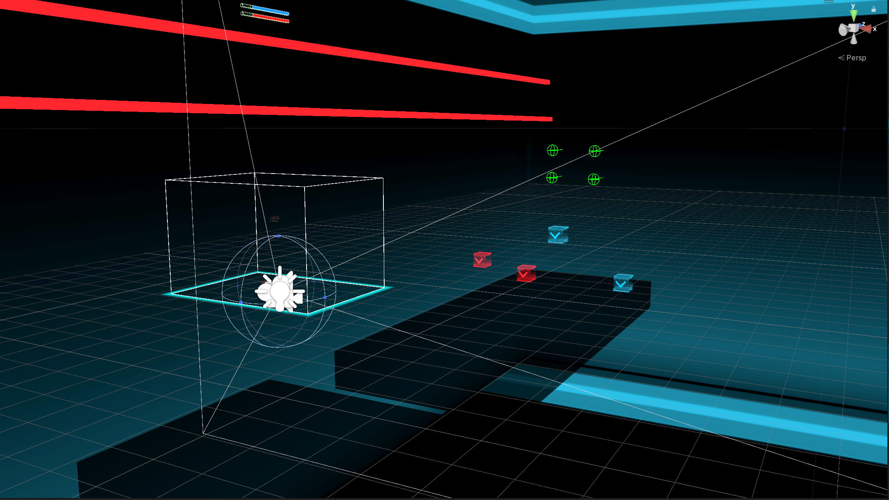
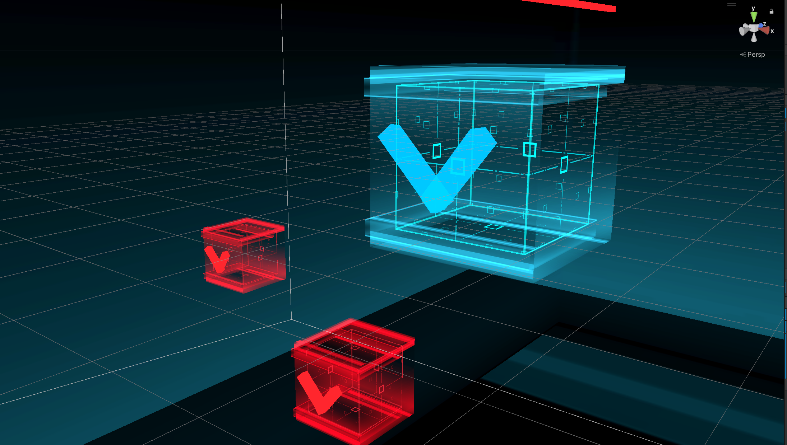
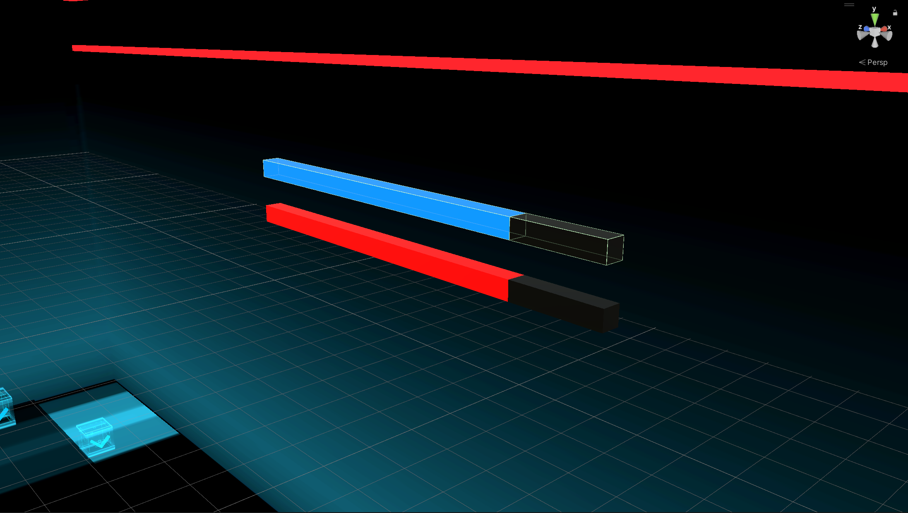

# VR_saber_game

This is a VR saber game project.

It was developed using Unity.

To play the game, you need to have a VR headset and a controller.

Steam is also needed to run the game.

---

## Installation

1. Clone the repository to your local machine.
2. Open steam and connect the headset.
3. Run the game(in the VR Saber folder)(My project.exe).

## What's the game about?

In the game, you will use the saber(in your hand) to cut the objects in the scene that come towards you.

It is a 3D game, so you will need to move around the scene using the controller.

---

# Just enjoy yourself
